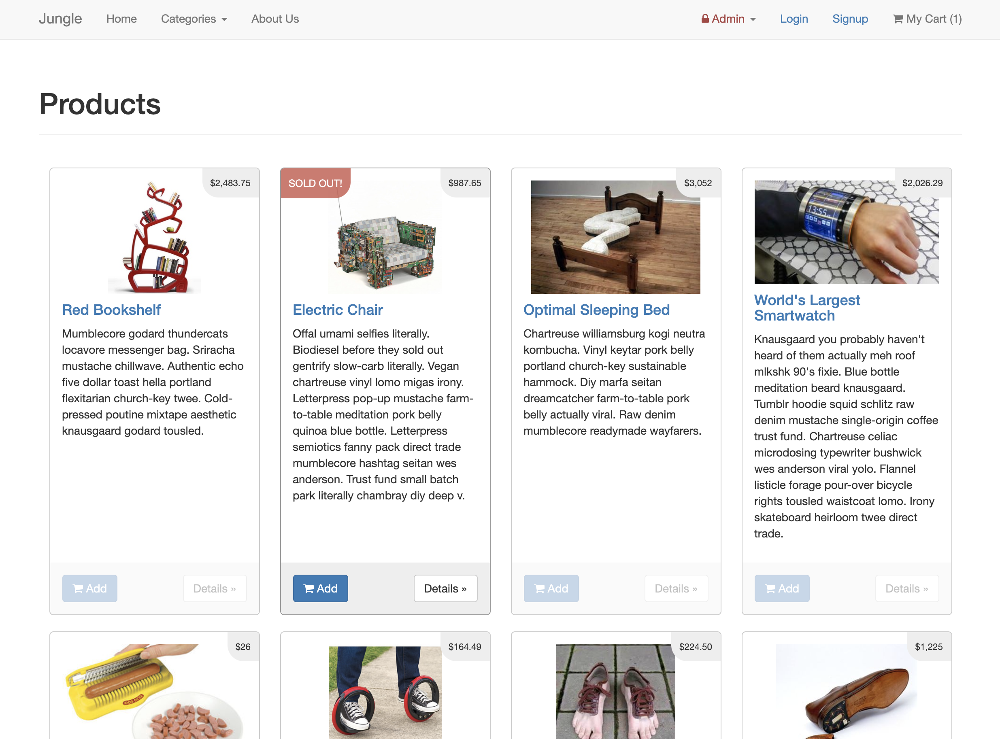
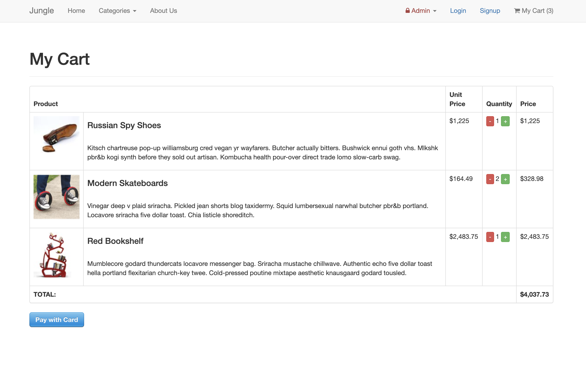
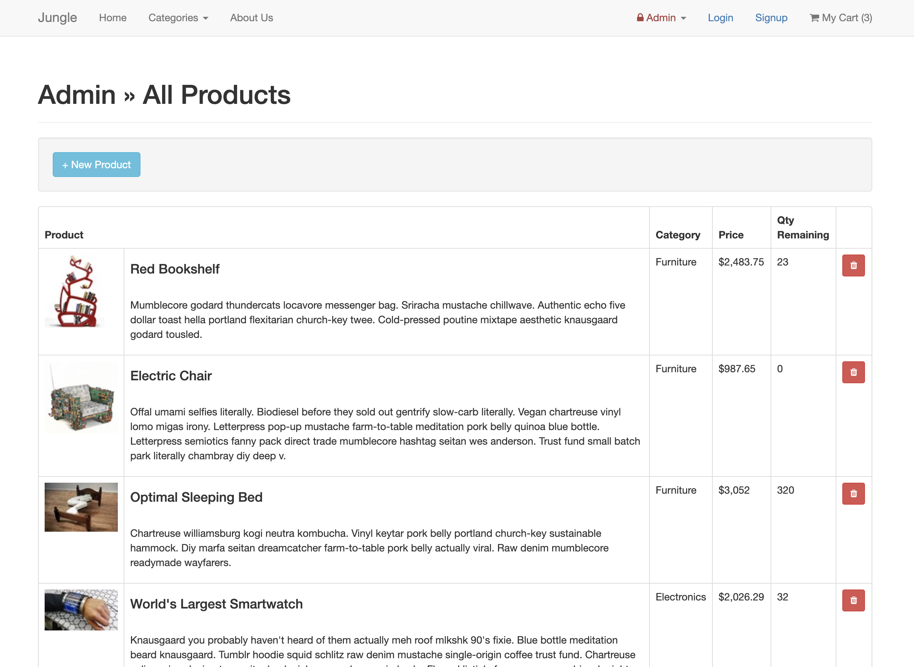

# Jungle

Having a tough time finding unique products that you can show off to your friends?

Welcome to the Jungle. Where weird is the new normal.

Built with Rails 4.2, Jungle brings you an e-commerce experience like no other, transforming the way you think about online shopping. 

## In Action

## Technology

An e-commerce application built with Rails 4.2, using idiomatic Ruby and Rails practices.

This app uses HTML, SCSS and JS on the front-end; Ruby on Rails and PostgreSQL on the back-end.

## Dependencies

* Rails 4.2
* PostgreSQL 9.x
* Stripe

## Features of Jungle

#### User Authentication

Signup/Login implemented using bcrypt with Rails.

#### Admin Privileges

Authenticated admins can add/edit/delete products and categories.

#### Product Selection

Visitors can browse and add products to cart directly from the home page.

Products can also be seen in their individual pages, or under their respective categories.

#### Checkout

Visitors can complete their purchase using Stripe, and see the details of their order.

## Testing

This app was tested using the following technologies:

- RSpec for unit testing
- Capybara and Poltergeist for integration testing

## Approach

This application was used as a training ground to learn Ruby on Rails.

Initially, the app was inherited as a half-built project, with requirements of implementing specific features and bug fixes. 

This allowed for the learning of Rails while working to improve a project that was originally built by experienced Rails developers.

## Getting Started

1. Run `bundle install` to install dependencies
2. Create `config/database.yml` by copying `config/database.example.yml`
3. Create `config/secrets.yml` by copying `config/secrets.example.yml`
4. Run `bin/rake db:reset` to create, load and seed db
5. Create .env file based on .env.example
6. Sign up for a Stripe account
7. Put Stripe (test) keys into appropriate .env vars
8. Run `bin/rails s -b 0.0.0.0` to start the server

## Stripe Testing

Use Credit Card # 4111 1111 1111 1111 for testing success scenarios.

More information in their docs: <https://stripe.com/docs/testing#cards>